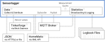

# Sensorlogger
Visit the [Sensorlogger website](https://tastyorange.de/projects/sensorlogger.htm) for a more structured documentation. (Auch auf [Deutsch](https://tastyorange.de/projekte/sensorlogger.htm) verfügbar.)

Sensorlogger reads sensor data and creates statistical reports in logbook tables. It can redistribute incoming sensor values, but also statistical summary data, to multiple MQTT brokers or to a HomeMatic CCU. Its original purpose was to serve as a logger for a weather station equipped with Tinkerforge sensors, where data has to be averaged and logged every 15 minutes. However, Sensorlogger is very flexible and can be configured to serve many other purposes.



Supported data sources are (selected) [Tinkerforge](https://www.tinkerforge.com) sensors and JSON structures that can be read via HTTP(s) or from local files. Additionally, you can subscribe to topics that are broadcast by MQTT brokers and read the values of system variables from a HomeMatic CCU. The values received via MQTT may also be embedded in their own JSON structures.

In the following listing you see a very simple example for a logbook file. It keeps track of the mean outside temperature and humidity every 30 minutes.

	# Time                 Temp [°C]    Humidity [%RH]
	2021-01-31 15:00:00    2.79615      65.0923
	2021-01-31 15:30:00    1.182        70.46
	2021-01-31 16:00:00    0.90467      75.36
	2021-01-31 16:30:00    0.56         75.8733
	2021-01-31 17:00:00    0.0286667    80.5067
	2021-01-31 17:30:00    -0.499333    84.76
	2021-01-31 18:00:00    -0.926       89.06
	2021-01-31 18:30:00    -1.14067     89.1933

## Data accumu­lation and statisti­cal summary

Sensorlogger is able to read values from Tinkerforge sensors and JSON structures in user-defined **time intervals.** After reading, these values can be forwarded immediately to MQTT brokers or to a HomeMatic CCU (the XML-API is used to set system variables using their ISE-ID). The values are also stored internally until they become irrelevant for any further statistical analysis.

Data can also be received via **interrupts,** for example from Tinkerforge IO bricklets or via subscriptions to MQTT topics.

Optionally, collected data can undergo **statistical processing.** Currently, Sensorlogger can calculate mean, median, sum, minimum, maximum, frequencies, counts and standard deviations. These are calculated for **logbook** columns that users can set up to their own liking in the configuration file. The statistical summary of a measurement cycle is then periodically written to a logbook file and/or broadcast to the MQTT brokers or a HomeMatic CCU.

## Software requirements

A system with support for 64 bit integer datatypes (C++ `uint64_t`) must be used. Usually, this is also the case for 32 bit architectures such as the Raspberry Pi or the Tinkerforge Red Brick. If 64 bit integers are not supported, Sensorlogger will show undefined behavior, because UNIX time stamps are processed with millisecond resolution.

Known software requirements for Linux:

+ C++11 compiler, such as GCC 6 or higher
+ Paho MQTT C and C++ libraries (and their dependencies)
+ Libcurl and its C++ developer tools

## Installation

At first, the Paho MQTT libraries for C and C++ must be installed. You can get packages for Arch-based distributions for the AUR: [paho-mqtt-c-git](https://aur.archlinux.org/packages/paho-mqtt-c-git/) and [paho-mqtt-cpp-git](https://aur.archlinux.org/packages/paho-mqtt-cpp-git/). For Debian-based systems (e.g. Raspberry Pi, Tinkerforge Red Brick) we have to compile and install the libraries on our own. To do this, we need to make sure that we already have all the required packages installed:

	apt-get install libssl-dev build-essential gcc make
	apt-get install cmake cmake-gui cmake-curses-gui

We now use git to download the [Eclipse Paho MQTT C library](https://github.com/eclipse/paho.mqtt.c), and compile and install it according to its documentation:

	git clone https://github.com/eclipse/paho.mqtt.c
	cd paho.mqtt.c
	make install

In the next step follows the [Eclipse Paho MQTT C++ library](https://github.com/eclipse/paho.mqtt.cpp). If you also want to install the documentation and compile the examples, set the corresponding flags in the following command in the third line to `TRUE`.

	git clone https://github.com/eclipse/paho.mqtt.cpp
	cd paho.mqtt.cpp
	cmake -Bbuild -H. -DPAHO_BUILD_DOCUMENTATION=FALSE -DPAHO_BUILD_SAMPLES=FALSE
	sudo cmake --build build/ --target install
	sudo ldconfig

We need `libcurl` to establish HTTP(s) connections in order to fetch JSON structures or connect to a HomeMatic XML-API.

	apt-get install libcurl4

In addition, the developer tools for `libcurl` are required:

	apt-get install libcurl-dev

The virtual package `libcurl-dev` offers different implementations. All of them should work, I have tested:

	apt-get install libcurl4-gnutls-dev

To compile Sensorlogger, run `make`.

	git clone https://github.com/davidplotzki/sensorlogger
	cd sensorlogger
	make


## Startup

To run Sensorlogger, you can pass the path to a configuration file:

	./sensorlogger /home/username/my_sensors.json

If you don’t provide the path to a configuration file, Sensorlogger will look for one under the name *sensorlogger.json* in its current working directory. If it doesn’t find one, it will quit.

### Sensorlogger as a service

It is recommended to run Sensorlogger with restricted privileges. The setup procedure for an automatic startup at boot time depends on the distribution. For Debian/Raspbian, I use a service file for systemd like the one shown below. It assumes that the executable file named `sensorlogger` is located in the user’s home directory at `/home/username`. The configuration file called `config.json` is also located there in this example.

	# /etc/systemd/system/sensorlogger.service
	# ------------------------------------------
	# systemctl daemon-reload
	# systemctl enable sensorlogger 
	
	[Unit]
	Description=Sensorlogger
	
	[Service]
	WorkingDirectory=/home/username
	ExecStart=/home/username/sensorlogger /home/username/config.json
	User=username
	Group=users
	
	[Install]
	WantedBy=multi-user.target

You could then use the following two commands to load the service into systemd and enable its automatic startup:

	systemctl daemon-reload
	systemctl enable sensorlogger


## General configuration

Further below, you will find a complete example configuration. Any Sensorlogger configuration file must be a JSON structure. It can contain the following sections, but not all of them are required.

+ `general` is meant for general settings and remarks (you can add your own). Currently, it only specifies the global event log file for errors and warnings.
+ `tinkerforge` contains the parameters for the connection to the Brick Daemon.
+ `mqtt` contains the parameters for connections to MQTT brokers.
+ `homematic` contains the parameters for the connection to the XML-API of a HomeMatic CCU.
+ `sensors` contains a description of all sensors from which data should be read. This is a JSON array that can contain an arbitrary number of sensor definition objects.
+ `logbooks` defines logbook files and associated `columns`. It is also a JSON array that can contain an arbitrary number of logbook definitions and their proper columns.

Generally, a configuration file must only contain the parameters and sections that you actually need. Irrelevant parameters can be omitted; if necessary, their standard values will be used. The standard values are presented in descriptions in the following sections.

**Hint:** you can use Firefox to open JSON files and make their tree structure visible. This can help you understand how JSON files work, and any errors in your file will be shown.

### Setting the log file

In the log file, status messages, warnings and errors will be reported. Please don’t confuse it with the log*books* used to record statistical data.

```
"general": {
    "logfile": "sensorlogger.log"
}
```

+ `"logfile":` path to a log file for status and error messages. Can be left blank or set to null if no log file is desired.

    Standard value: `null`

### Example configuration

Shown below is an example configuration file for the following scenario.

+ An outside **weather station** has two Tinkerforge sensors: one for temperature, another one for wind. A Temperature Bricklet is used for the temperature measurement. The wind anemometer is connected to an IO Bricklet at channel 0 and Sensorlogger is used to count digital events (whenever a *low* state is reached).
+ In the **living room** we have a different temperature sensor that sends its measurements to an MQTT broker. Sensorlogger subscribes to its topic. Additionally, there is a HomeMatic humidity sensor in the living room. Sensorlogger reads its datapoint values every two minutes via the XML-API from the HomeMatic CCU.
+ The **solar generator** is monitored by another application and its current state is reported in a local JSON file. The value for the currently produced electric power is read by Sensorlogger from its configured key sequence in the JSON tree.
+ Two **logbooks** are defined: one for the weather station and another one for the house. The **weather** logbook contains one line every five minutes. In two columns, it contains the mean temperature for the last 15 minutes and the wind anemometer’s rotation frequency for the last five minutes (which is the logbook’s cycle time). The logbook for the **house** contains two columns for the mean living room temperature and humidity of the last 15 minutes (again, the cycle time) and two more columns for the mean and maximum electric power produced during the past 60 minutes.
+ Both the current sensor values as well as the statistical results for the logbook columns are sent to the **MQTT broker** using their own topics, as well as to the **HomeMatic CCU** using the ISE IDs for special system variables.

```
{
    "general": {
        "logfile": "/home/username/sensorlogger.log"
    },

    "tinkerforge": {
        "comment": "Connecting to the Brick Daemon, and error management.",
        "host": "192.168.1.2",
        "port": 4223,
        "max_bricklet_read_failures":  2,
        "max_brickd_restart_attempts": 3,
        "brickd_restart_command": null,
        "system_restart_command": null  
    },

    "mqtt": [
        {
            "comment": "Connecting and communicating with the MQTT broker.",
            "host": "192.168.1.3",
            "port": 1883,
            "qos": 1,
            "retained": false,
            "connected_topic": "Sensorlogger/status",
            "connected_message": "online",
            "lwt_topic": "Sensorlogger/status",
            "lwt_message": "offline",
            "enable_publish": true,
            "enable_subscribe": true,
            "topic_domain": ""
        }
    ],

    "homematic": {
        "comment": "URL of your HomeMatic's XML API",
        "xmlapi_url": "http://192.168.1.4/config/xmlapi"
    },

    "sensors": [
        {
            "comment": "Tinkerforge sensor for outside temperature.",
            "sensor_id": "Weather/Temperature",
            "tinkerforge_uid": "z3L",
            "channel": 0,
            "factor": 1,
            "offset": -4,
            "counter": false,
            "trigger": "periodic",
            "rest_period": {"value": 60, "unit": "s"},
            "mqtt_publish": "Weather/Temperature/current",
            "homematic_publish": "25484"
        },
        {
            "comment": "Tinkerforge IO bricklet triggers counter.",
            "sensor_id": "Weather/Wind",
            "tinkerforge_uid": "9Ws",
            "channel": 0,
            "counter": true,
            "trigger": "low",
            "rest_period": {"value": 8, "unit": "ms"},
            "io_debounce": {"value": 8, "unit": "ms"}
        },
        {
            "comment": "MQTT sensor for the living room temperature.",
            "sensor_id": "House/Living_Room/Temperature",
            "mqtt_subscribe": "House/Living_Room/Temperature/current",
            "factor": 1,
            "offset": 0,
            "counter": false,
            "trigger": "periodic",
            "rest_period": {"value": 2, "unit": "min"},
            "homematic_publish": "74633"
        },
        {
            "comment": "HomeMatic sensor for the living room humidity.",
            "sensor_id": "House/Living_Room/Humidity",
            "homematic_subscribe": "94836",
            "factor": 1,
            "offset": 0,
            "counter": false,
            "trigger": "periodic",
            "rest_period": {"value": 2, "unit": "min"},
            "mqtt_publish": "House/Living_Room/Humidity/current"
        },
        {
            "comment": "Current solar power from local JSON file.",
            "sensor_id": "House/Solar/Power",
            "json_file": "/var/log/solar.json",
            "json_key":  ["solar", "creation", "power"],
            "factor": 1,
            "offset": 0,
            "trigger": "periodic",
            "rest_period": {"value": 5, "unit": "s"},
            "mqtt_publish": "House/Solar/Power/current",
            "homematic_publish": "23674"
        }
    ],

    "logbooks": [
        {
            "filename": "weather.txt",
            "cycle_time": {"value": 5, "unit": "min"},
            "max_entries": 288,
            "missing_data": "-",
            "columns": [
                {
                    "title": "Temperature 15 minute average",
                    "unit":  "°C",
                    "sensor_id": "Weather/Temperature",
                    "operation": "mean",
                    "evaluation_period": {"value": 15, "unit": "min"},
                    "mqtt_publish": "Weather/Temperature/average15min",
                    "homematic_publish": "83472"
                },
                {
                    "title": "Wind sensor rotation frequency",
                    "unit":  "Hz",
                    "sensor_id": "Weather/Wind",
                    "operation": "freq",
                    "mqtt_publish": "Weather/Wind/average15min",
                    "homematic_publish": "75653"
                }
            ]
        },
        {
            "filename": "house.txt",
            "cycle_time": {"value": 15, "unit": "min"},
            "max_entries": 48,
            "missing_data": "-",
            "columns": [
                {
                    "title": "Living room temperature",
                    "unit":  "°C",
                    "sensor_id": "House/Living_Room/Temperature",
                    "operation": "mean",
                    "mqtt_publish": "House/Living_Room/Temperature/average15min",
                    "homematic_publish": "23545"
                },
                {
                    "title": "Living room humidity",
                    "unit":  "%rel.",
                    "sensor_id": "House/Living_Room/Humidity",
                    "operation": "mean",
                    "mqtt_publish": "House/Living_Room/Humidity/average15min",
                    "homematic_publish": "12736"
                },
                {
                    "title": "Mean solar power (last 60 minutes)",
                    "unit":  "W",
                    "sensor_id": "House/Solar/Power",
                    "operation": "mean",
                    "evaluation_period": {"value": 1, "unit": "h"},
                    "mqtt_publish": "House/Solar/Power/mean",
                    "homematic_publish": "34653"
                },
                {
                    "title": "Peak solar power (last 60 minutes)",
                    "unit":  "W",
                    "sensor_id": "House/Solar/Power",
                    "operation": "max",
                    "evaluation_period": {"value": 1, "unit": "h"},
                    "mqtt_publish": "House/Solar/Power/peak",
                    "homematic_publish": "34654"
                }
            ]
        }
    ]
}
```

## Tinkerforge settings

Currently, version 2.1.32 (2021-05-06) of the [Tinkerforge](https://www.tinkerforge.com/) C/C++ bindings are used. The following Tinkerforge Bricklets are supported. The table also lists the channel IDs if a Bricklet supports different types of measurements.

| Sensor                         | Channels                                          |
| ------------------------------ | ------------------------------------------------- |
| Air Quality                    | `0`: Indoor air quality (IAQ) index               |
|                                | `1`: Temperature                                  |
|                                | `2`: Relative humidity                            |
|                                | `3`: Air pressure                                 |
| Ambient Light                  |                                                   |
| Ambient Light 2.0              |                                                   |
| Ambient Light 3.0              |                                                   |
| Analog In                      |                                                   |
| Analog In 2.0                  |                                                   |
| Analog In 3.0                  |                                                   |
| Barometer                      |                                                   |
| Barometer 2.0                  |                                                   |
| CO2                            |                                                   |
| CO2 2.0                        | `0`: CO2 concentration                            |
|                                | `1`: Temperature                                  |
|                                | `2`: Relative humidity                            |
| Current12                      |                                                   |
| Current25                      |                                                   |
| Distance IR                    |                                                   |
| Distance IR 2.0                |                                                   |
| Distance US                    |                                                   |
| Distance US 2.0                |                                                   |
| Dust                           |                                                   |
| Energy Monitor                 | `0`: Voltage                                      |
|                                | `1`: Current                                      |
|                                | `2`: Energy                                       |
|                                | `3`: Real power                                   |
|                                | `4`: Apparent power                               |
|                                | `5`: Reactive power                               |
|                                | `6`: Power factor                                 |
|                                | `7`: Frequency                                    |
| Humidity                       |                                                   |
| Humidity 2.0                   |                                                   |
| Industrial Digital In 4        | `0` to `3`                                        |
| Industrial Digital In 4 2.0    | `0` to `3`                                        |
| Industrial Dual 0-20mA         | `0` to `1`                                        |
| Industrial Dual 0-20mA 2.0     | `0` to `1`                                        |
| Industrial Dual Analog In      | `0` to `1`                                        |
| Industrial Dual Analog In 2.0  | `0` to `1`                                        |
| IO4                            | `0` to `3`, also as a pulse counter               |
| IO4 2.0                        | `0` to `3`, also as a pulse counter (not testet)  |
| IO16                           | `0` to `15`, also as a pulse counter (not testet) |
| IO16 2.0                       | `0` to `15`, also as a pulse counter (not testet) |
| Laser Range Finder             |                                                   |
| Laser Range Finder 2.0         |                                                   |
| Line                           |                                                   |
| Load Cell                      |                                                   |
| Load Cell 2.0                  |                                                   |
| Moisture                       |                                                   |
| Particulate Matter             | `1` or `10`: PM1.0                                |
|                                | `2` or `25`: PM2.5                                |
|                                | `3` or `100`: PM10                                |
| PTC Temperature                |                                                   |
| PTC Temperature 2.0            |                                                   |
| Sound Intensity                |                                                   |
| Sound Pressure Level           |                                                   |
| Temperature                    |                                                   |
| Temperature 2.0                |                                                   |
| Temperature IR                 | `0`: Ambient                                      |
|                                | `1`: Object                                       |
| Temperature IR 2.0             | `0`: Ambient                                      |
|                                | `1`: Object                                       |
| UV Light                       |                                                   |
| UV Light 2.0                   |                                                   |
| Voltage                        |                                                   |
| Voltage/Current                | `0`: Voltage                                      |
|                                | `1`: Current                                      |
| Voltage/Current 2.0            | `0`: Voltage                                      |
|                                | `1`: Current                                      |

### Connection to the Brick Daemon

The general `tinkerforge` section is used to configure the connection parameters to the Brick Daemon.

```
"tinkerforge": {
    "host": "localhost",
    "port": 4223,
    "max_bricklet_read_failures":  8,
    "max_brickd_restart_attempts": 3,
    "brickd_restart_command": "sudo /bin/systemctl restart brickd",
    "system_restart_command": "sudo /bin/systemctl --force reboot"  
}
```
+ `"host":` Hostname or IP address where the Tinkerforge Brick Daemon can be reached. May be omitted or set to `null` if you don’t want to configure any Tinkerforge sensors.

    Standard value: `null`

+ `"port":` Port on the host to connect to the Brick Daemon.

+ `"max_bricklet_read_failures":` Sets a first limit for a maximum number of subsequent readout failures for Bricklets that are polled periodically. If the limit is reached, it is reported in the global log file and `brickd_restart_command` is executed (if defined).

    Standard value: `7`

+ `"max_brickd_restart_attempts":` The maximum number of subsequent attempts to restart the Brick Daemon to solve readout failures. If this limit is reached, it is reported in the global log file and `system_restart_command` is executed (if defined).

    Standard value: `3`

+ `"brickd_restart_command":` Command to be executed when the maximum number of subsequent Bricklet readout failures is reached. The intention is to issue a service restart command for the Brick Daemon on the command line in order to solve readout hiccups. Sometimes, this helps. Please note that if you issue any `sudo` command, the user that runs Sensorlogger must be allowed to execute this command without entering a password. This can be set up accordingly in the sudoers file.

    Standard value: `null`

+ `"system_restart_command":` Command to be executed when the maximum number of subsequent Brick Daemon restarts is reached and did not solve the sensor readout failures. The intention is to issue a command to restart the entire system. In my experience, this can be of temporary help under very bad conditions (like in a weather station), but it should only be used when such drastic measures are really necessary and a restart does not disrupt any other services. Please note that if you issue any `sudo` command, the user that runs Sensorlogger must be allowed to execute this command without entering a password. This can be set up accordingly in the sudoers file.

    Standard value: `null`

On any normally running system, you should not use the restart parameters and instead omit them or set them to `null`. Please only use them if you are fully aware of what you’re doing.

```
"brickd_restart_command": null,
"system_restart_command": null
```

### Tinkerforge sensors

#### Polling in specific time intervals

```
"sensors": [
    ...
    {
        "sensor_id": "Weather/Temperature",
        "tinkerforge_uid": "z3L",
        "factor": 1,
        "offset": -4.5,
        "channel": 0,
        "mqtt_publish": "House/Weather/Temperature/current",
        "homematic_publish": "12345",
        "counter": false,
        "trigger": "periodic",
        "rest_period": {"value": 60, "unit": "s"}
    },
    ...
]
```

+ `"sensor_id":` General, unique ID for the sensor that will later be referenced when defining statistics and logbooks.

+ `"tinkerforge_uid":` UID of the Tinkerforge Bricklet, as displayed e.g. in the Brick Viewer.

+ `"factor":` Correction factor, see next point.

    Standard value: `1`

+ `"offset":` Correction offset. The resulting sensor value is then calculated from `factor`·(measurement+`offset`).

    Standard value: `0`

+ `"channel":` Channel that is supposed to be polled. Only relevant for Bricklets with multiple channels or measurement possibilities. The available channels are listed in the table above.

    Standard value: `0`

+ `"io_port":` If an IO-16 Bricklet is used, this parameter specifies the port `"a"` or `"b"`.

    Standard value: `"a"`

+ `"mqtt_publish":` Topic that is used to publish the polled and possibly corrected sensor value via MQTT.

    Standard value: `null`

+ `"homematic_publish":` ISE ID of the HomeMatic system variable that should be set to the polled and possibly corrected sensor value.

    Standard value: `null`

+ `"counter":` Specifies if this sensor is a pure counter. In this case, the variable must be set to `true`. This means that no measurement value is kept in the data storage, but all messages are counted. For logbook statistics, it will only be possible to evaluate the number of measurements and their frequency, but none of the other statistical operations (such as mean) will give any meaningful results. If a sensor is polled very often, it can save memory not to keep all measurements of a measurement cycle if the intention is for example to only forward them via MQTT, or if this sensor acts as an event counter (see next section).

    Note that measurements are always counted, irrespective of this configuration parameter. You will always be able to evaluate count and frequency when running the statistical analysis.

    Standard value: `false`

+ `"trigger":` Defines how a measurement is triggered. In case of periodically polled sensors, this parameter must be set to `"periodic"`. For external triggers, see the next section.

    Standard value: `"periodic"`

+ `"rest_period":` Time for the sensor to rest between two measurements. The sensor is polled again after the rest period has passed. The numerical part for this parameter is set under `"value"`, its unit under `"unit"`. The following units are allowed: `"ms"`, `"s"`, `"min"`, `"h"`, `"d"`.

    Standard value: 60 s, minimum: 100 ms

#### External triggers

Only Tinkerforge IO Bricklets are currently supported as external triggers.

```
"sensors": [
    ...
    {
        "sensor_id": "Weather/Wind",
        "tinkerforge_uid": "9Ws",
        "channel": 0,
        "io_port": "a",
        "factor": 0.5,
        "offset": 0,
        "mqtt_publish": "House/Weather/Wind/last-pulse",
        "counter": true,
        "trigger": "low",
        "rest_period": {"value": 7, "unit": "ms"},
        "io_debounce": {"value": 7, "unit": "ms"}
    },
    ...
]
```

+ `"sensor_id":` General, unique ID for the sensor that will later be referenced when defining statistics and logbooks.

+ `"tinkerforge_uid":` UID of the Tinkerforge Bricklet, as displayed e.g. in the Brick Viewer.

+ `"channel":` Channel of the IO Bricklet that should trigger the interrupt. Note that the channel numbers start at zero.

    Standard value: `0`

+ `"io_port":` If an IO-16 Bricklet is used, this parameter specifies the port `"a"` or `"b"`.

    Standard value: `"a"`

+ `"factor":` Correction factor, see next point.

    Standard value: `1`

+ `"offset":` Correction offset. The resulting sensor value is then calculated from `factor`·(measurement+`offset`). For digital sensors such as the IO Bricklets the measurement value is always 0 (low) or 1 (high) and can be weighted or shifted by the factor and offset parameters.

    Standard value: `0`

+ `"mqtt_publish":` Topic that is used to publish the received and possibly corrected sensor value via MQTT.

    Standard value: `null`

+ `"homematic_publish":` ISE ID of the HomeMatic system variable that should be set to the received and possibly corrected sensor value.

+ `"counter":` Specifies if this sensor is a pure counter. In this case, the variable must be set to `true`. This means that no measurement value is kept in the data storage, but all messages are counted. For logbook statistics, it will only be possible to evaluate the number of triggered events and their frequency, but none of the other statistical operations (such as mean) will give any meaningful results. If a sensor triggers very often, it can save memory not to keep all the events of a measurement cycle if this sensor only acts as an event counter.

    Note that measurements are *always* counted, irrespective of this configuration parameter. You will always be able to evaluate count and frequency when running the statistical analysis.

    Standard value: `false`

+ `"trigger":` Specifies which events trigger a measurement. Currently, only Tinkerforge IO Bricklets are supported. For those, the following keywords can be used:
    - `"low"` — Measurement is triggered when the level falls to *low*.
    - `"high"` — Measurement is triggered when the level rises to *high*.
    - `"high_or_low"` — Measurement is triggered when the level changes its state from *low* to *high* or the other way around.
    - `"periodic"` — Periodically polled sensor. See previous section.

    Standard value: `"periodic"` (see previous section)

+ `"rest_period":` Time for the sensor to rest between two measurements. In case of an externally triggered sensor, this is the minimum time that must pass between two measurements. Any measurements arriving within a shorter time period are rejected and not recorded.

    If a Bricklet triggers a lot of events, this parameter can serve as a debounce time at the receiving end of the Sensorlogger. The Brick Daemon can get its own debounce time using the parameter shown under the next point. The `"rest_period"` parameter becomes important if you want to avoid a flood of events that are only due to latencies in the connection between Brick Daemon and Sensorlogger. Latencies can have bad effects on frequency evaluation (especially the maximum frequency), because events can only be time-tagged once they arrive at the Sensorlogger.

    The numerical part for this parameter is set under `"value"`, its unit under `"unit"`. The following units are allowed: `"ms"`, `"s"`, `"min"`, `"h"`, `"d"`.

    Standard value: 60 s

+ `"io_debounce":` Debounce time for the Brick Daemon to avoid multiple events from bouncing at the digital input of the IO Bricklet. The value is passed to the Brick Daemon upon [Callback registration](https://www.tinkerforge.com/en/doc/Software/Bricklets/IO4_Bricklet_C.html). The numerical part for this parameter is set under `"value"`, its unit under `"unit"`. The following units are allowed: `"ms"`, `"s"`, `"min"`, `"h"`, `"d"`.

    Standard value: 7 ms


## MQTT settings

The general `mqtt` section is used to configure the parameters for the connections to the MQTT brokers. Any number of MQTT brokers can be set up. The following example shows a configuration for two separate brokers.

```
"mqtt": [
    {
        "comment": "Configuration for Broker #1",
        "host": "192.168.1.3",
        "port": 1883,
        "qos": 1,
        "retained": false,
        "connected_topic": "Sensorlogger/status",
        "connected_message": "online",
        "lwt_topic": "Sensorlogger/status",
        "lwt_message": "offline",
        "enable_publish": true,
        "enable_subscribe": false,
        "topic_domain": ""
    },
    {
        "comment": "Configuration for Broker #2",
        "host": "192.168.1.8",
        "port": 1883,
        "qos": 1,
        "retained": false,
        "connected_topic": "Sensorlogger/status",
        "connected_message": "online",
        "lwt_topic": "Sensorlogger/status",
        "lwt_message": "offline",
        "enable_publish": false,
        "enable_subscribe": true,
        "topic_domain": "House/Living_Room"
    }
]
```

+ `"host":` Hostname or IP address where the MQTT broker can be reached. May be omitted or set to `null` if you don’t want to configure any MQTT connection.

    Standard value: `null`

+ `"port":` Port on the host to connect to the MQTT broker.

+ `"qos":` Quality of Service (QoS) for the connection to the MQTT broker.

    Standard value: `1`

+ `"retained":` If set to `true`, messages will be sent with the *retained* flag, which signals the MQTT broker to store any message until a new message for the respective topic arrives. This also affects the *Last Will & Testament (LWT)* message.

    Standard value: `false`

+ `"connected_topic":` When Sensorlogger successfully connects to the MQTT broker, it can broadcast a first status message under this topic.

    Standard value: `null`

+ `"connected_message":` Content of the message to be broadcast when successfully connecting to the MQTT broker.

    Standard value: `null`

+ `"lwt_topic":` Topic for the *Last Will & Testament (LWT)* that the MQTT broker will use to broadcast a message if the connection to Sensorlogger is lost.

    Standard value: `null`

+ `"lwt_message":` Message for the *Last Will & Testament (LWT)* that the MQTT broker will broadcast if the connection to Sensorlogger is lost.

    Standard value: `null`

+ `"topic_domain":` Can be used to restrict this broker to a certain set of topics. All topics that this broker handles must start with this string. This parameter can be used as a filter mask when multiple MQTT brokers are defined. If the broker should handle all topics, an empty string can be used.

    Standard value: `""`

+ `"enable_publish":` If set to `true`, all values that belong to the topic domain will be published to this MQTT broker. Can be set to `false` to disable publishing to this broker. The connected and LWT messages will be sent to the broker regardless of this parameter.

    Standard value: `true`

+ `"enable_subscribe":` If set to `true`, this MQTT broker will be used to subscribe to topics that belong to its topic domain. Can be set to `false` to disable any subscriptions for this broker.

    Standard value: `true`

### MQTT sensors

```
"sensors": [
    ...
    {
        "sensor_id": "Shelly/AnalogTemp",
        "mqtt_subscribe": "shelly/tele/SENSOR",
        "json_key": ["ANALOG", "Temperature"],
        "factor": 1,
        "offset": 0,
        "counter": false,
        "mqtt_publish": "House/Living_Room/Temperature/current",
        "homematic_publish": "12345",
        "rest_period": {"value": 2, "unit": "s"}
    },
    {
        "sensor_id": "Weather/Rainrocker",
        "mqtt_subscribe": "House/Weather/Rainrocker",
        "json_key": null,
        "factor": 0.5,
        "offset": 0,
        "counter": true,
        "rest_period": {"value": 100, "unit": "ms"}
    },
    ...
]
```

+ `"sensor_id":` General, unique ID for the sensor that will later be referenced when defining statistics and logbooks.

+ `"mqtt_subscribe":` Topic that shall be subscribed for this sensor.

+ `"json_key":` If the value is not sent as a pure number, but embedded in a JSON structure, the value’s key sequence on the JSON tree can be specified here. To identify a key on the upper level, a simple string identifying the key’s name is enough. To reach deeper levels, you need to provide an array of key identifiers. If you need to access elements within JSON arrays, provide an integer number to specify the position within the array (note that indexing starts at 0).

    Standard value: `null`

+ `"factor":` Correction factor, see next point.

    Standard value: `1`

+ `"offset":` Correction offset. The resulting sensor value is then calculated from `factor`·(measurement+`offset`).

    Standard value: `0`

+ `"counter":` Specifies if this sensor is a pure counter. In this case, the variable must be set to `true`. This means that no measurement value is kept in the data storage, but all messages are counted. For logbook statistics, it will only be possible to evaluate the number of received MQTT messages and their frequency, but none of the other statistical operations (such as mean) will give any meaningful results. If a sensor triggers very often, it can save memory not to keep all the events of a measurement cycle if only the number of events or their frequency is of interest (like for the wind sensor in the example above).

    Note that measurements are *always* counted, irrespective of this configuration parameter. You will always be able to evaluate count and frequency when running the statistical analysis.

    Standard value: `false`

+ `"mqtt_publish":` Topic that is used to republish the received and possibly corrected sensor value via MQTT. Cannot be the same topic as `mqtt_subscribe`.

    Standard value: `null`

+ `"homematic_publish":` ISE ID of the HomeMatic system variable that should be set to the received and possibly corrected sensor value.

    Standard value: `null`

+ `"rest_period":` Time for the sensor to rest between two measurements. This is the minimum time that must pass between two MQTT messages. Any measurements arriving within a shorter time period are rejected and not recorded. The numerical part for this parameter is set under `"value"`, its unit under `"unit"`. The following units are allowed: `"ms"`, `"s"`, `"min"`, `"h"`, `"d"`.

    Standard value: 60 s


## HomeMatic settings

You can set up a connection to a HomeMatic CCU to read numerical data points and to set system variables. This way, sensor values from other sources can be sent to the CCU right after the measurement or after the statistical analysis. The communication is handled via the [XML-API](https://github.com/homematic-community/XML-API), which must be installed as an add-on for the HomeMatic CCU.

To get an overview of the available data points for your CCU and their respective ISE-ID, you can access `statelist.cgi` which the XML-API provides. Sensorlogger can read such data points using queries to `state.cgi?datapoint_id=...`, and it can set the values of system variables using `statechange.cgi`.

The root URL to reach the XML-API must be specified in the general `homematic` section of your configuration file:

```
"homematic": {
    "xmlapi_url": "http://192.168.1.4/addons/xmlapi"
}
```

+ `"xmlapi_url":` URL to reach the XML-API.

    Standard value: `null`


### Reading HomeMatic data points

```
"sensors": [
    ...
    {
        "sensor_id": "House/Living_Room/Humidity",
        "homematic_subscribe": "94836",
        "factor": 1,
        "offset": 0,
        "counter": false,
        "trigger": "periodic",
        "rest_period": {"value": 2, "unit": "min"},
        "mqtt_publish": "House/Living_Room/Humidity/current"
    },
    ...
]
```

+ `"sensor_id":` General, unique ID for the sensor that will later be referenced when defining statistics and logbooks.

+ `"homematic_subscribe":` ISE-ID of the data point to read periodically.

+ `"factor":` Correction factor, see next point.

    Standard value: `1`

+ `"offset":` Correction offset. The resulting sensor value is then calculated from `factor`·(measurement+`offset`).

    Standard value: `0`

+ `"counter":` Specifies if this sensor is a pure counter. In this case, the variable must be set to `true`. This means that no measurement value is kept in the data storage, but all messages are counted. For logbook statistics, it will only be possible to evaluate the number of measurements and their frequency, but none of the other statistical operations (such as mean) will give any meaningful results. If a sensor is polled very often, it can save memory not to keep all measurements of a measurement cycle if the intention is for example to only forward them via MQTT, or if this sensor acts as an event counter.

    Note that measurements are *always* counted, irrespective of this configuration parameter. You will always be able to evaluate count and frequency when running the statistical analysis.

    Standard value: `false`

+ `"mqtt_publish":` Topic that is used to publish the polled and possibly corrected sensor value via MQTT.

    Standard value: `null`

+ `"homematic_publish":` ISE ID of the HomeMatic system variable that should be set to the polled and possibly corrected sensor value.

    Standard value: `null`

+ `"rest_period":` Time for the sensor to rest between two measurements. The variable is polled again after the rest period has passed. The numerical part for this parameter is set under `"value"`, its unit under `"unit"`. The following units are allowed: `"ms"`, `"s"`, `"min"`, `"h"`, `"d"`.

    Standard value: 60 s


## Measurements from JSON structures

JSON structures can be read from files or via HTTP(s) to serve as a source for sensor values. To define such a sensor, the path (or URL) of the JSON file must be provided, as well as the complete key sequence within the JSON tree to access the value.

```
"sensors": [
    ...
    {
        "sensor_id": "Sensor/JSONTemp",
        "json_file": "/home/user/weather.json",
        "json_key":  ["Weather", "Temperature"],
        "factor": 1,
        "offset": 0,
        "mqtt_publish": "House/Weather/Temperature/current",
        "homematic_publish": "12345",
        "rest_period": {"value": 5, "unit": "s"}
    },
    ...
]
```

+ `"sensor_id":` General, unique ID for the sensor that will later be referenced when defining statistics and logbooks.

+ `"json_file":` Path to the JSON file that will be read periodically. This can be a location on the local file system, or a URL that is accessible via HTTP(s).

+ `"json_key":` The value’s key sequence on the JSON tree. To identify a key on the upper level, a simple string identifying the key’s name is enough. To reach deeper levels, you need to provide an array of key identifiers. If you need to access elements within JSON arrays, provide an integer number to specify the position within the array (note that indexing starts at 0).

+ `"factor":` Correction factor, see next point.

    Standard value: `1`

+ `"offset":` Correction offset. The resulting sensor value is then calculated from `factor`·(measurement+`offset`).

    Standard value: `0`

+ `"mqtt_publish":` Topic that is used to publish the polled and possibly corrected sensor value via MQTT.

    Standard value: `null`

+ `"homematic_publish":` ISE ID of the HomeMatic system variable that should be set to the polled and possibly corrected sensor value.

    Standard value: `null`

+ `"counter":` Specifies if this sensor is a pure counter. In this case, the variable must be set to `true`. This means that no measurement value is kept in the data storage, but all messages are counted. For logbook statistics, it will only be possible to evaluate the number of measurements and their frequency, but none of the other statistical operations (such as mean) will give any meaningful results. If a sensor is polled very often, it can save memory not to keep all measurements of a measurement cycle if the intention is for example to only forward them via MQTT, or if this sensor acts as an event counter.

    Note that measurements are *always* counted, irrespective of this configuration parameter. You will always be able to evaluate count and frequency when running the statistical analysis.

    Standard value: `false`

+ `"rest_period":` Time for the sensor to rest between two measurements. The JSON file is polled again after the rest period has passed. The numerical part for this parameter is set under `"value"`, its unit under `"unit"`. The following units are allowed: `"ms"`, `"s"`, `"min"`, `"h"`, `"d"`.

    Standard value: 60 s, Minimum: 100 ms


## Statistics & Logbooks

Any statistical evaluation of the collected data is bound to a logbook column. If you want to get the results from a statistical operation, you have to configure a logbook column. It doesn’t matter if the logbook is only virtual or imaginary and you are only interested in broadcasting your statistics via MQTT, or if the logbook will actually be written as a real file.

As a file, logbooks are tab-separated text files where the collected values from the most recent measurement cycle are statistically summarized and recorded. You can set up an arbitrary number of logbooks, each with their own variety of columns for different statistical operations, sensors and cycle times. A very simple example of the content of a logbook file is shown below. It collects the 30 minute mean values for two different sensors.

	# Time                 Temp [°C]    Humidity [%RH]
	2021-01-31 15:00:00    2.79615      65.0923
	2021-01-31 15:30:00    1.182        70.46
	2021-01-31 16:00:00    0.90467      75.36
	2021-01-31 16:30:00    0.56         75.8733
	2021-01-31 17:00:00    0.0286667    80.5067
	2021-01-31 17:30:00    -0.499333    84.76
	2021-01-31 18:00:00    -0.926       89.06
	2021-01-31 18:30:00    -1.14067     89.1933

### Logbook configurations

The `logbooks` key in the configuration file is always a JSON array that may contain any number of logbook configurations.

```
"logbooks": [
    ...
    {
        "filename": "/home/user/weather/weatherlog.txt",
        "cycle_time": {"value": 15, "unit": "min"},
        "max_entries": 96,
        "missing_data": "-",
        "columns": [
            ...
        ]
    },
    ...
]
```

+ `"filename":` Specifies the path and filename where the logbook shall be saved. If set to `null`, the logbook will not be saved as a real file, but statistics will still be published via MQTT or sent to the HomeMatic CCU, if intended.

    Standard value: `null`

+ `"cycle_time":` Duration of a measurement cycle. Please note that the cycle time should be well above the rest period (polling intervals) of the individual sensors in order to accumulate some values for the statistics to make sense. The numerical part for this parameter is set under `"value"`, its unit under `"unit"`. The following units are allowed: `"ms"`, `"s"`, `"min"`, `"h"`, `"d"`.

    Standard value: 15 min

+ `"max_entries":` Maximum number of logbook entries (i.e. lines). If the number is exceeded, the oldest entries will be deleted.

    Standard value: `30`

+ `"missing_data":` String that is used for entries where data is missing. This can happen if a sensor cannot be reached during the whole measurement cycle or if the rest period of a sensor is longer than the measurement cycle.

    Standard value: `"-"`

+ `"columns":` JSON array where all the columns for this logbook are defined. Please refer to the following section on how to set up logbook columns.


### Logbook columns

The `"columns"` key (as a child node of a logbooks object) always hosts a JSON array that can contain the definitions of an arbitrary number of columns. The very first column of any logbook is always a time stamp that shows when the statistics has been calculated. All the remaining columns are configured here.

```
"columns": [
    ...
    {
        "title": "Temperature",
        "unit":  "°C",
        "sensor_id": "Weather/Temperature",
        "mqtt_publish": "House/Weather/Temperature/mean",
        "homematic_publish": "34572",
        "operation": "mean",
        "evaluation_period": {"value": 1, "unit": "h"},
        "confidence_absolute": 10.0,
    },
    {
        "title": "Humidity",
        "unit":  "%rel",
        "sensor_id": "Weather/Humidity",
        "mqtt_publish": "House/Weather/Humidity/median",
        "homematic_publish": "37856",
        "operation": "median",
        "confidence_sigma": 3.0
    },
    {
        "title": "Wind",
        "unit":  "Hz",
        "sensor_id": "Weather/Wind",
        "mqtt_publish": "House/Weather/Wind/frequency",
        "homematic_publish": "22156",
        "operation": "freq",
        "count_factor": 0.5
    },
    ...
]
```

+ `"title":` The column’s title, as displayed in the first (commented) header line of the logbook file.

+ `"unit":` The column’s unit for all of its values, as displayed in square brackets next to the title in the first header line of the logbook file.

    Standard value: `null`

+ `"sensor_id":` A unique string that identifies the sensor that shall be evaluated here. The ID was specified in previous sections when setting up the individual sensors.

+ `"mqtt_publish":` Topic that is used to publish the result of the statistical operation via MQTT.

    Standard value: `null`

+ `"homematic_publish":` ISE ID of the HomeMatic system variable that should be set to the result of the statistical operation.

    Standard value: `null`

+ `"operation":` Statistical operation that shall be applied to the values of the most recent measurement cycle in order to calculate the column value. The following operations are allowed:
    - `"mean"` — Arithmetic mean
    - `"median"` — Median value
    - `"max"` — Maximum
    - `"min"` — Minimum
    - `"sum"` — Sum
    - `"stddev"` — Standard deviation (RMSD) around the arithmetic mean
    - `"stddev_mean"` — Standard deviation (RMSD) around the arithmetic mean
    - `"stddev_median"` — Standard deviation (RMSD) around the median value
    - `"count"` — Number of measurements, or number of events in case of an externally triggered sensor.
    - `"freq"` — Frequency of the incoming measurements, in 1/s.
    - `"freq_min"` — Minimum overall frequency that has occurred during the last measurement cycle. This is the inverse of the maximum time between two incoming events or measurements. In 1/s.
    - `"freq_max"` — Maximum overall frequency that has occurred during the last measurement cycle. This is the inverse of the minimum time between two incoming events or measurements. In 1/s. **Warning:** If you want to use this for a pulse counter, be aware that events can only be time-tagged once they arrive at the Sensorlogger. The actual point in time of the pulse creation is not known. Latencies, especially when receiving values over the network or even via USB, can lead to event showers and have strong effects on the maximum and minimum frequency.

    Standard value: `"mean"`

+ `"evaluation_period":` Length of the time period that shall be evaluated. If not defined, this will be the logbook’s cycle time, but you can set any other value here. For example, this parameter can be used to calculate a moving average. The numerical part for this parameter is set under `"value"`, its unit under `"unit"`. The following units are allowed: `"ms"`, `"s"`, `"min"`, `"h"`, `"d"`.

    Standard value: `null`

+ `"count_factor":` This factor can be used to weight the number of events of a pulse counter. It only affects the counter operations `"count"`, `"freq"`, `"freq_min"` and `"freq_max"`. In the example above, the wind sensor triggers two pulses per rotation, so we scale the pulse frequency by a factor of 0.5 to get the rotation frequency.

    Standard value: `1`

+ `"confidence_absolute":` This parameter can be used to reduce the influence of outliers on the statistical result, for example when calculating the mean value. Any measurements that deviate by more than a given absolute value *a* from the median value *μ* are not considered during the statistical analysis. This means that we define a confidence interval *μ*±*a* which contains all values that are relevant for the statistical operation for this column.

    This outlier reduction technique will be applied before the following operations: `"mean"`, `"median"`, `"max"`, `"min"`, `"sum"`, `"stddev"`, `"stddev_mean"` and `"stddev_median"`. If the parameter is omitted or set to `0` or `null`, all of the collected values are considered and outlier reduction is turned off.

    Standard value: `null`

+ `"confidence_sigma":` This parameter can be used to reduce the influence of outliers on the statistical result, for example when calculating the mean value. It specifies the size of the confidence interval around the median value *μ* in units of the standard deviation *σ* (RMSD around the median). This means that with this parameter, a factor *f* can be set such that all values in the interval *μ*±(*f*·*σ*) are considered for the statistical operation.

    Note that outliers can significantly increase the standard deviation *σ*, depending on the total number of measurements. This means that the factor *f* should not be chosen too high to avoid including outliers in the confidence interval. But *f* should also not be too low in order to avoid elimination of too many values.

    In certain cases it can happen that this outlier reduction technique eliminates all values, e.g. when the confidence interval is too narrow. In this case, the only representative for the measurement cycle is the original median value of the collected data points. This would not necessarily have a bad effect on averaging, but it strongly affects sums, minimums, maximums and standard deviations.

    To get a better feeling of what is happening here, you can set up a second column with no confidence interval applied, or another column where the actual standard deviation of all measurements is listed to see some typical values for your use case.

    This outlier reduction technique will be applied before the following operations: `"mean"`, `"median"`, `"max"`, `"min"`, `"sum"`, `"stddev"`, `"stddev_mean"` and `"stddev_median"`. If the parameter is omitted or set to `0` or `null`, all of the collected values are considered and outlier reduction is turned off.

    If both methods are defined, this outlier reduction has precedence and the one defined for `"confidence_absolute"` (previous point) is ignored.

    Standard value: `null`